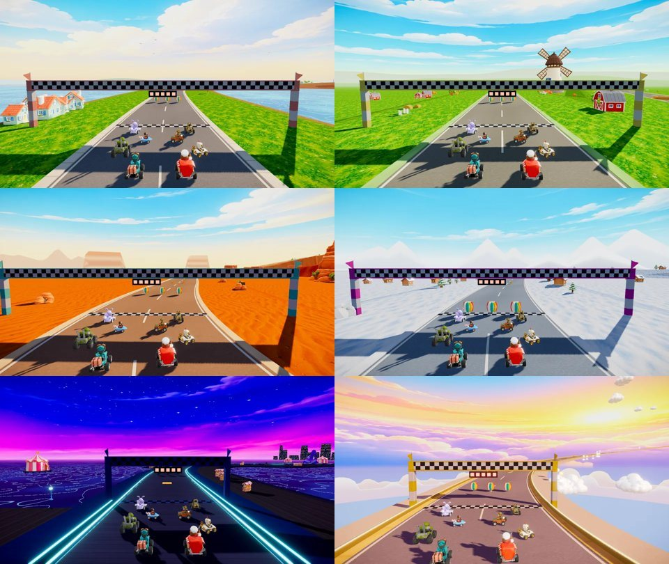
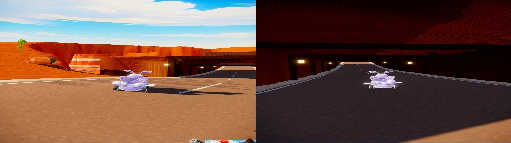
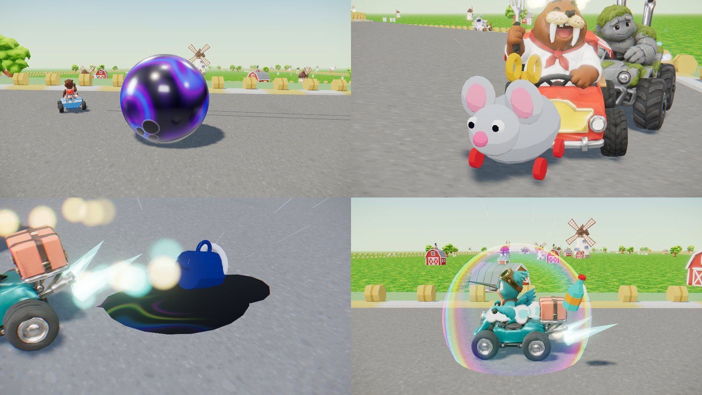
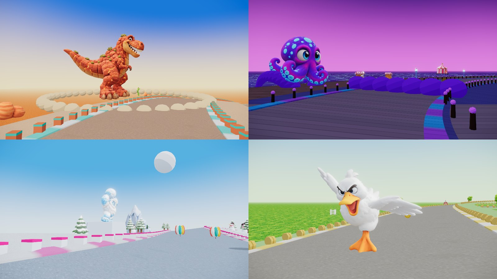

# Rascal Rally!

A bright cartoon kart racer for the browser. Eight original racers drift, boost and trade items across six worlds, and on every final lap the track fights back.

**▶ Play now: https://adamwebsiteformula.github.io/kart-racer/**
Works in any modern browser (Chrome, Edge, Firefox, Safari): keyboard, gamepad, or a phone turned sideways. Sound on.


## How to play

| Action | Keyboard | Gamepad |
|---|---|---|
| Go | W or ↑ | RT |
| Steer | A D or ← → | Left stick |
| Brake / reverse | S or ↓ | LT |
| Hop and drift (hold) | Shift or Space | A |
| Use item | E or X | X |
| Look back / throw behind | Q (hold while using an item) | B |
| Horn | H | Y |
| Pause | Esc or P | Start |

**Drift to win.** Hold drift through a corner: sparks go blue, then orange, then purple. Let go for a mini-turbo. Press go just as the **2** shows at the start for a rocket start.

## What's in it

- **8 racers**, each with their own kart, horn and "ouch": Pip, Momo, Nova, Juniper, Otto, Sprocket, Boulder and Big Gus.
- **6 tracks in 2 cups.** Each has a **Final Lap Shift**: the tide comes in, a storm fells a tree across the shortcut, a rope bridge collapses and the only way on is through a lantern-lit mine, a blizzard freezes the lake into a shortcut, fireworks turn the Ferris wheel into a ramp, and sunset retracts the sky bridges.
- **13 items**, held two at a time like Mario Kart World, each our own idea: roll down the road as a giant **Strike Ball** and knock rivals flying like pins, boing over trouble on a **Pogo Spring** and slam down, hook the racer ahead with a **Grapple Anchor** and slingshot past, send a **Wind-Up Mouse** weaving through the pack, blast off on **Fizz Pop** soda (or three of them), plus beach balls, a homing kite, oil, a decoy balloon, an air horn, a bubble shield and a fog bank. Hold the button to trail a ball or a trap behind you as a shield. Gold double balloons fill both slots.
- **5 modes:** Quick Race, Grand Prix (points and stars), Knockout (8 → 6 → 4 → 2), Time Trial (bronze, silver and gold medals) and a Daily Challenge.
- **Global leaderboards** for Time Trial and Daily. Every run is re-simulated on the server, so posted times are real.
- **Original music and sound:** 7 songs and 58 effects, a real engine sound, and a final-lap music lift.
- Runs at 60 fps. The game lowers its own resolution on slower laptops.






## Built with AI

Built for the *AI Automations with Jack* September 2026 game competition.

| Part | Tool |
|---|---|
| Design, code, tests, tuning and the red-team review | Claude Code (Claude Opus) |
| Racer concept art, portraits and 3D models | Higgsfield (GPT Image 2.5 → Tripo image-to-3D) |
| Music and sound effects | ElevenLabs (Eleven Music, Sound Effects) |
| Engine | Three.js, TypeScript, Vite; Supabase for the leaderboard |

**Tested by AI, too.** Teams of AI reviewers played the game headlessly: one team hunted bugs area by area, each bug proved by a test, and a second team tried to disprove every one. In the last week of the build, three rounds found and fixed 56 bugs, from a gamepad Start that unpaused at once to a kart left floating when the final-lap route changed.






## Run it yourself

```bash
npm install
npm run dev
```

Useful commands: `npm run verify` (type check plus 688 tests), `npm run build`, `npm run check:bundle`. Credits and licences are in [CREDITS.md](CREDITS.md).
