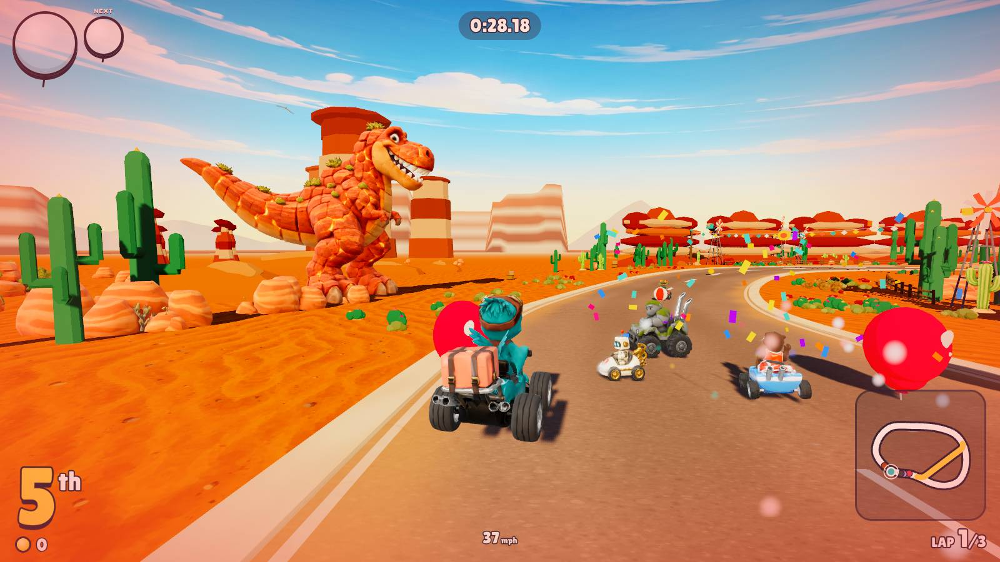
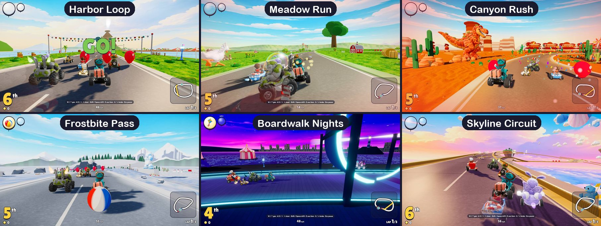
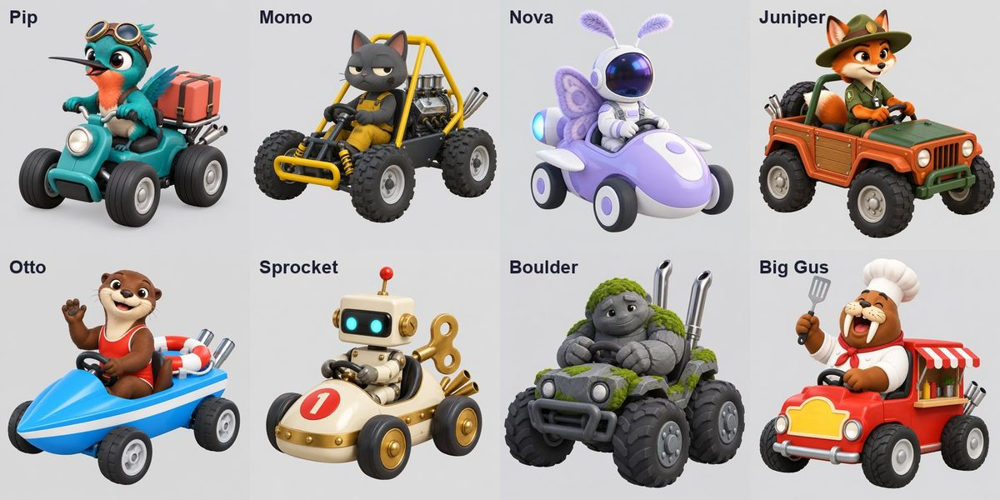
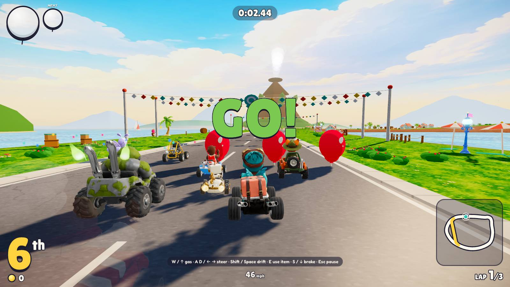
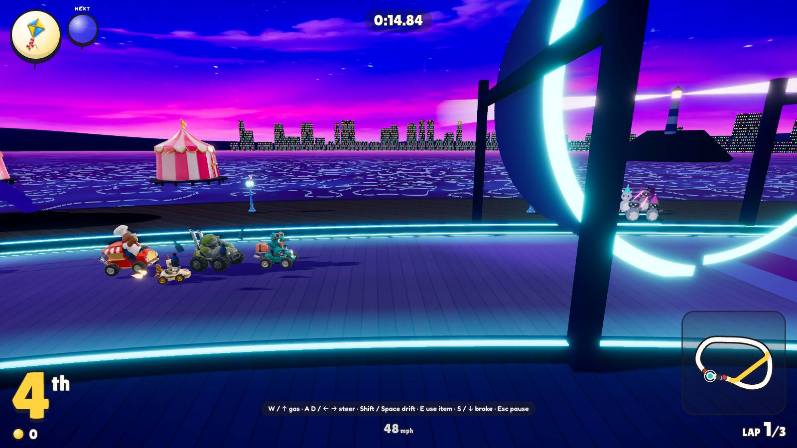

# Rascal Rally! Contest entry

*AI Automations with Jack, September 2026 game competition. Entries due September 30, 2026.*

A bright cartoon kart racer for the browser. Eight original racers drift, boost and trade items across six worlds, and on every final lap the track fights back. It is inspired by the feel of Mario Kart World. Every racer, track, item and sound is our own.

- **Play:** https://adamwebsiteformula.github.io/kart-racer/
- **Code:** https://github.com/AdamWebsiteFormula/kart-racer
- Keyboard, gamepad or touch (a phone turned sideways); tested in Chrome, Firefox and Safari. Sound on, or add `?mute` to the address for a silent game.

## At a glance

| What | Detail |
|---|---|
| Racers | 8 originals in 3 classes; 3 unlockable paints and 2 unlockable kart bodies |
| Tracks | 6 in 2 cups, each with a giant creature and a Final Lap Shift |
| Items | 13 originals, two held at a time |
| Modes | Quick Race, Grand Prix, Knockout, Time Trial, Daily Challenge, plus Mirror |
| Sound | 102 sound effects and 7 instrumental songs |
| Sim | Fixed 120 Hz, deterministic, bit-identical across chips and JavaScript engines |
| Leaderboard | Global; the server replays every run and stores its own time |
| Speed | 60 fps measured; title on screen in under 1 s on fast 4G; 446 KB of gzipped code |
| Tests | 1,465 automated, run before every deploy |

## How to play

| Action | Keyboard | Gamepad | Touch |
|---|---|---|---|
| Steer | A / D or ← / → | Left stick or D-pad | Left pad |
| Gas | W or ↑ | RT | Automatic |
| Brake / reverse | S or ↓ | LT | BRAKE |
| Hop and drift | Shift or Space | A | DRIFT |
| Use item (hold to keep it behind you) | E or X | X | ITEM |
| Look back (throw backward) | Q | B | LOOK |
| Horn | H | Y | None |
| Pause | Esc or P | Start | Pause button at the top |

- **Drift.** Hold drift through a turn: the sparks go blue after 0.55 s, orange after 1.33 s and purple after 2.33 s (a little longer with the stick pushed out of the turn). Let go for a mini-turbo of 0.8, 1.5 or 2.4 s.
- **Start boost.** Press the gas the moment the **2** appears. On a phone, put a thumb on the screen then.
- **Tricks.** Off a ramp or a bump, press drift in the air for a trick boost when you land.
- **Slipstream.** Stay right behind a racer for 2 seconds for a boost.
- **Coins.** Each one adds a little top speed, up to 10. A hit spins you out and costs 2.
- **Balloons.** Pop one for an item. A gold pair fills both slots.
- **Falls.** Drive off an open edge and a claw on a cable carries you back to the road.

## Modes

| Mode | What it is |
|---|---|
| Quick Race | One track, eight racers, 50cc, 100cc or 150cc. |
| Grand Prix | The Sunrise Cup or the Summit Cup: three tracks, points and up to three stars, then the podium ceremony. |
| Knockout | Eight start on three linked tracks, two laps each: the top 6 go through, then the top 4, then win the final. The item pool shrinks with the field. |
| Time Trial | No items, 150cc: race your best run's ghost for bronze, silver and gold, and post your time to the global board. |
| Daily Challenge | Today's track with balloons on, the same for everyone, on its own global board. A new one starts at midnight UTC. |
| Mirror | Every track reflected left to right, for Quick Race and Grand Prix. Unlocked by Time Trial gold on every track. |

## The world

### Tracks

| Track | Cup | World | Creature | Thrills | Final Lap Shift |
|---|---|---|---|---|---|
| Harbor Loop | Sunrise | Seaside town | A giant crab scuttles across the road | Pier ramp, beach shortcut, barrels rolling off the pier | The tide comes in and closes the beach shortcut |
| Meadow Run | Sunrise | Rolling farmland | A giant goose honks, then charges down the road | Hairpin, long slipstream straight, haystack ramp, hay-hump trick bumps, runaway hay bales | A storm rolls in: the sky darkens, grip drops and the hedgerow shortcut closes |
| Canyon Rush | Sunrise | Red-rock desert | The Rumblesaur rears up and stomps a shock ring across the road | Geysers that throw you into the air, a mine shortcut through a mesa, dune bumps, mine carts, cliff edges with no walls | The rope bridge falls; the only way on is through the lantern-lit mine |
| Frostbite Pass | Summit | Snowy mountain village | A yeti lobs snowballs from its ledge | Ski jump, mogul bumps, steam vents, ice | A blizzard closes in and the frozen lake opens as a shortcut |
| Boardwalk Nights | Summit | Night carnival | A kraken slams a tentacle across the planks | Neon loop-the-loop, bumper cars, teacups, an arcade-alley shortcut | Fireworks finale: a ramp opens at the Ferris wheel |
| Skyline Circuit | Summit | Cloud islands | A sky whale's tail slap sends a gust across the road | A climb to 94 m, an island-hop jump, airship wake gusts, open edges | Sunset to starlight: the narrow sky rail becomes the only road |

- The Final Lap Shift fires once, for everyone, when the leader starts the last lap, with a banner, a new sky and its own 4.5-second rumble, whoosh and shimmer.
- Each shift plays a set piece that reads from the chase camera in 2 to 3 seconds: the tide rolls in over the beach road, lightning fells an oak across the hedgerow cut, the rope bridge snaps and falls plank by plank, the lake freezes out from the crossing, two Ferris-wheel spokes swing down into the new ramp under fireworks, and the old sky bridges retract. Flashes stay at most three a second; reduced motion cuts instead of sweeping.
- Every creature warns first (a shadow, a rumble, a wind-up), and the AI sees and dodges it like any hazard.
- Every track has 5 or 6 boost pads and a shortcut, and every shortcut is tested to be worth taking: a Hard AI forced onto it must be at least as fast as the road.

### Racers

| Racer | Who | Class | Signature kart |
|---|---|---|---|
| Pip | Hummingbird courier, fast-talking, never stops moving | Light | Delivery scooter |
| Momo | Cat mechanic, deadpan and competent | Light | Stripped-down buggy |
| Nova | Moth astronaut, drawn to the lights | Light | Thruster pod |
| Juniper | Fox park ranger, cheerful rule-follower, secretly fierce | Medium | Wood-panel off-roader |
| Otto | Otter lifeguard, waves at everyone | Medium | Water-scooter kart |
| Sprocket | Wind-up robot, counts laps aloud | Medium | Tin-toy racer |
| Boulder | Rock golem, says sorry after ramming | Heavy | Stone monster truck |
| Big Gus | Walrus chef, feeds rivals after races | Heavy | Food-truck kart |

Light racers accelerate and turn best; heavy ones win the shoving matches. Top speeds differ by only 2%, and the AI's solo times per class sit within about 3% of each other. Every racer has a horn and a hit yelp.

Unlocks (looks only; the racer owns the class): Pip's Berry paint (Time Trial gold on every Sunrise Cup track), Boulder's Frost paint (win a Knockout), Sprocket's Mint paint (fire 10 purple drift boosts), the Classic body (finish a Grand Prix), the Buggy body (race a Knockout to the end) and Mirror mode (Time Trial gold on every track).

### Items

| Item | What it does |
|---|---|
| Beach Ball | Throw it ahead. It bounces off the sides three times. |
| Homing Kite | Flies after the racer in front of you. |
| Oil Can | Leaves a slick behind you. Whoever drives in slows to half speed. |
| Decoy Balloon | Looks just like a real balloon, but spins out whoever grabs it. |
| Air Horn | A 6 m blast all around you: clears items and spins racers nearby. |
| Bubble | A shield that stops one hit, for up to 8 seconds. |
| Fizz Pop | One big burst of speed, even off the road. |
| Triple Fizz | Three bursts of speed, and faster drift sparks. |
| Fog Bank | Slows everyone ahead and takes their items. Works from 5th place back. |
| Strike Ball | Become a giant bowling ball for 5 seconds: roll on your own and knock racers flying like pins. |
| Pogo Spring | Boing over trouble. Press again in the air to slam down. |
| Grapple Anchor | Hook the racer ahead (up to 50 m), reel in, then slingshot past. |
| Wind-Up Mouse | Scurries ahead, weaving, and bumps up to three racers. |

Two slots: a second balloon spins the second slot while you can still use the first. Hold the button to trail a Beach Ball, Oil Can, Decoy Balloon or Wind-Up Mouse behind you, where it blocks one shot from behind. The leaders draw traps, a shield and small boosts; the back of the pack draws the comeback powers, and the Strike Ball and Fog Bank never roll in the first 15 seconds or the leader's last 8.

### Race day

  
  

- **Course intro.** Before each race the camera flies the course in four moves: a high sweep toward the far landmark, a low glide along the track's signature stretch (over Harbor's pier ramp toward the crab, under the yeti's ledge as it throws, beside Boardwalk's loop), a pass along the cheering grandstand, and a crane down onto your kart that lands exactly on the race camera as the countdown begins. A title card names the track, the cup and the race. 5.9 seconds (2.5 in Time Trial and the Daily); any button skips it.
- **Finish celebration.** Over the line the camera swings round in slow motion while your racer reacts to the place: a leap with a full turn and fist pumps for 1st, a hop and a big wave for 2nd, two happy hops for 3rd, and for the back of the field a sag and a head shake that ends chin up.
- **Podium ceremony.** After a Grand Prix or a Knockout final, the top three stand on stepped blocks in their own karts, our own gold cup with a red balloon on its lid pops up behind the winner, and confetti and fireworks go up over the stands.
- **A living world.** Far vistas in three depth layers with a landmark ahead of every start line (Harbor's is a smoking volcano island); gulls, songbirds, a V of geese, pterosaurs, eagles, fireworks and airships lit at night; over a hundred critter spectators per track (otters and gull-folk in sun hats, penguins and snow hares in beanies, raccoons with glow sticks) who turn to watch the pack and cheer as it passes.
- **Karts with weight.** They lean out of turns (harder out of drifts, the inside wheels lifting), pitch under the gas, brakes and boosts, squash and spring over hops and landings, and shiver on the grid; the driver leans, looks and nods, and the front wheels steer.
- **Speed you can feel.** Each boost punches the view wider by its tier (5, 7.5 or 10 degrees for blue, orange and purple), with flames and sparks in the tier's color.

### Sound

- **102 sound effects and 7 instrumental songs**, made for this game with ElevenLabs, with a coded Web Audio synth behind them as a fallback. Engines sound by class, a boost revs the engine, drift sparks crackle louder each tier, and the wheels sound like the ground: sand, snow, ice, planks or the rail. The music lifts on your final lap.
- **Mixed by measurement.** A headless renderer drives the real audio engine through whole races and measures the result offline. Each of the player's cues now plays over the music and engines at its median level, and none is buried more than 12 dB under them (294 were before); the mix plays at about -16 LUFS with true peaks at -1.8 dBTP or lower.
- **Checked by ear models.** A local CLAP model ranked every sound against its own prompt; the ten suspects that both CLAP and Qwen2.5-Omni heard as something else were remade until they sounded like what they are (the slipstream, the three boosts, the kite and the anchor among them). Local models (Qwen2.5-Omni, AST, CLAP) hear no voice or singing in any 10-second window of any song. A Gemini Pro "judge" scores sounds against their moment in the game; it picked the Final Lap Shift's sound from 14 takes.

## Under the hood

### A sim that replays exactly
- A fixed 120 Hz simulation with render interpolation and kinematic karts (no physics engine). Every race system (ground snap, checkpoints, AI, places, minimap, the Final Lap Shift) runs off one track spline.
- JavaScript's `Math.sin`, `cos`, `atan2` and friends differ in their last bits between chips and browsers, so the sim uses its own port of fdlibm instead of 85 `Math` calls, and a guard test fails on any new one. Proof: an 8-racer race dumped tick by tick (8,001 ticks) is byte-identical on an arm64 Mac, linux/arm64 and linux/amd64, and a real run replays to the same time in V8, Safari's JavaScriptCore and the live server.
- The pictures never touch the sim: the course intro, the celebration and the podium leave input logs, results and leaderboard replays unchanged, and tests hold them to it.

### A leaderboard you can trust
- A Time Trial or Daily run posts its input log (4 bytes a tick, run-length encoded). A Supabase Edge Function replays it with the real game code and stores the replay's own time; a forged time is refused.
- Hardened over three red-team passes, checked live:
  - a strict Content-Security-Policy (scripts from the site only, no inline code or eval, the network only to the site and the leaderboard) and no referrer;
  - the score function answers only the game's own pages (an origin allowlist) and caps and times out uploads;
  - each client (a salted hash of the address) gets 10 tries a minute and 60 accepted runs a day, counted in one database step that fails closed, and at most 3 names per board, enforced inside the insert;
  - row-level security with no table access: the public can call one read function and nothing else;
  - a name filter shared by the game and the server that reads leetspeak, spacing and stretched letters, while ordinary names that happen to contain a flagged word still pass.

### Performance
- Measured in silent headless Chrome on an M4 Pro's GPU: full three-lap races with vsync on held 16.7 ms frames with none over 20 ms on Harbor Loop, Canyon Rush and Boardwalk Nights at 1920×1080, and also at 2560×1440 at pixel ratio 2 and with the CPU slowed 4×. The course intro flies at 16.7 ms a frame.
- No shader hitches: every shader compiles in a warm-up hidden behind the intro's title card, before the countdown.
- 69 to 86 draw calls mid-race with 8 karts (measured on all six tracks), one shadow map; a test holds every track's draw and triangle budget.
- An Auto quality governor steps resolution, then shadows and effects, down on a machine that falls under 55 fps, at a calm moment and without flip-flopping.
- Loading the live site, cold cache on fast 4G (25 Sept 2026): first paint in 0.5 s, the title in 0.94 to 0.98 s. A race loads behind its course intro, which flies over the track and can be skipped. The code is 446 KB gzipped.

### Accessibility and reach
- Reduce motion (follows the system, or on or off): the intro holds still shots, the finish drops its slow motion and swoops, and the camera moves less.
- Item letters (Settings) put a letter on every item icon, so no item relies on color.
- Screen readers: live regions announce banners, the intro card and messages; results rows, star badges and emoji carry labels.
- Full keyboard and gamepad menus with a clear focus ring; the on-screen prompts switch to the pad's buttons after a pad press.
- Phones: touch controls and a race screen fitted to real phone sizes on their side; turned upright, the race pauses and asks you to turn the phone.
- Every word a player reads is US English and rated G, and a test pins every number in How to Play to the code.

### Tests
- 1,465 automated tests in 159 files, all headless: kart physics, AI gates on every track, whole races, the leaderboard replay, the drift payoff, the frame and allocation budgets, and jsdom accessibility checks.
- `npm run verify` (type check, tests, build, 1.5 MB bundle gate) runs in CI on every push before GitHub Pages publishes the site.

## How it was built

1. **Blueprint first** (September 5): a design bible, seven JSON data schemas, one SOP per system and a build ritual: research, plan, build, critique, verify.
2. **System by system**, written by Claude Code (Claude Opus) agents: the kart controller, track builder, race manager, AI driver, items, UI, audio, art pipeline, effects, leaderboard, performance and deploy. Builder agents work in parallel git worktrees; the main session merges them and runs the full verify after every merge. Each SOP keeps dated decisions and a repair loop's lessons (error, cause, fix, rule).
3. **Critique and review.** Code critiques from a critique agent and a second model (Codex); then AI bug hunts across the game (almost every fix lands with a test that proves it), a seam review, a detail review and three red-team passes on the client and the leaderboard.
4. **Silent checks.** Agents never play a sound on the build machine. They drive the game in muted headless Chrome: frame times on the real GPU, screenshots of every screen, and gameplay clips that Gemini watches at 8 frames a second and critiques (two such reviews reshaped the course intro's camera moves). Sound is judged by the local listening models and the Gemini judge, and the mix is measured offline.

| Part | Made with |
|---|---|
| Design, code, tests, tuning and reviews | Claude Code (Claude Opus), several agents in parallel |
| Second-opinion code reviews | Codex |
| Racer concept art and portraits, 12 painted skies | GPT Image 2.5 via Higgsfield |
| Item art and ground textures | AI images via Higgsfield |
| 8 racer models; 31 creature, landmark and scenery models | Image-to-3D via Higgsfield (Tripo H3.1 for the racers) |
| Tracks, the Classic and Buggy bodies, spectators, vistas, sky life and effects | Modeled in code |
| 7 songs and 102 sound effects | ElevenLabs (Eleven Music, Sound Effects) |
| Listening checks | CLAP, AST and Qwen2.5-Omni (local), Gemini Pro |
| Gameplay video review | Gemini |
| Engine | Three.js, postprocessing, three-mesh-bvh, TypeScript, Vite |
| Leaderboard and hosting | Supabase (Postgres and an Edge Function), GitHub Pages |

## A five-minute tour

- **Canyon Rush** (Quick Race, Sunrise Cup): watch the intro, ride a geyser early in the lap, hop the Rumblesaur's shock ring near the end, and on the last lap take the mine. To see the claw, drive off an unwalled edge about halfway round the lap.
- **Boardwalk Nights** (Summit Cup): the kraken, then the neon loop right after it; fireworks and the Ferris-wheel ramp on the last lap.
- **Drift** a long bend until the sparks go purple and feel the camera punch.
- **From the back of the pack**, look for a Strike Ball: the back draws the big items.
- **Finish a Grand Prix** for the podium ceremony.
- **Time Trial** for the ghost and medals, and the **Daily Challenge** for the global board.
- **Pause, then Settings** for Reduce motion and Item letters.

## Which prize fits

- **Best Game:** the full package: five modes plus Mirror, a replay-verified global leaderboard, 1,465 tests and three red-team passes.
- **Most Creative:** the Final Lap Shift, the course creatures, the claw rescue, the neon loop, and items of our own (Strike Ball, Grapple Anchor, Pogo Spring).
- **Eye Candy:** the AI-made 3D cast and creatures, painted skies, course intros, far vistas, crowds and sky life, and night neon on Boardwalk Nights.
- **One More Go:** drifting that pays, Time Trial ghosts and medals, and a new Daily Challenge every day.

## Honest notes

- The frame times were measured on an M4 Pro. On a mid-range laptop, the Auto governor trades resolution or effects to hold 60 fps; that estimate comes from measured ratios, not from a run on such a laptop.
- The Final Lap Shift's new scenery is built during the race's warm-up and only swapped in on its tick; what is left on that tick is the sim's own route change: on Canyon Rush about 5.5 ms of script on the M4 Pro and about 20 ms with the CPU slowed 4× (it was about 75 ms).
- The leaderboard checks physics, not people: a bot that drives well would pass. Any row can be hidden with one line of SQL.

## Skool post (paste as is)

**Rascal Rally!** A cartoon kart racer you can play in your browser right now, built end to end with AI.

Play: https://adamwebsiteformula.github.io/kart-racer/
Code: https://github.com/AdamWebsiteFormula/kart-racer

What's in it:
- 8 original racers, 6 tracks, and drifting that pays: hold a turn for blue, orange, then purple sparks and a mini-turbo
- A giant creature on every track: a rock dinosaur whose stomp sends a shock ring across the road, a snowball-throwing yeti, a kraken that slams a tentacle across the boardwalk, and more
- **Final Lap Shift:** on the last lap every track changes (the tide comes in, a blizzard freezes the lake into a shortcut, the bridge goes down and the only way on is a lantern-lit mine)
- 13 original items, held two at a time: bowl rivals over as a giant **Strike Ball**, boing over trouble on a **Pogo Spring**, hook the racer ahead with a **Grapple Anchor** and slingshot past
- A camera fly-through before every race, a slow-motion finish, and a podium ceremony after a Grand Prix or Knockout
- Grand Prix, Knockout (8 start, cuts after every race, one champion), Time Trial with ghosts and medals, and a Daily Challenge on a global leaderboard where the server replays every run
- Plays on keyboard, gamepad and phone (turn it sideways)

How AI built it:
- **Claude Code** (Opus) designed and wrote the whole game: physics, AI rivals, items, tracks, UI, the leaderboard server and 1,465 tests. It also ran teams of AI agents that hunted bugs, red-teamed the security and checked every screen in silent headless Chrome
- **Higgsfield:** the racer, creature and scenery 3D models (AI images turned into 3D), the painted skies and the item art
- **ElevenLabs:** 7 songs and 102 sound effects, checked by AI listening models
- **Supabase:** the leaderboard

My favorite moment: hopping the dinosaur's shock ring on the last lap while a Strike Ball knocks the pack flying. Tell me your best time on the Daily Challenge!

## 60-second video script

Start on the title screen (a race runs behind the logo). Keep the game full screen.

| Time | Show on screen | Say |
|---|---|---|
| 0–5 s | The title screen | "This is Rascal Rally, a kart racer I built with AI, and you can play it in your browser right now." |
| 5–12 s | A Quick Race on **Canyon Rush**: the course intro sweeps down onto your kart | "Every race opens with a fly-through of the course." |
| 12–20 s | Drift a long bend until the sparks go purple, then boost | "Eight racers, six tracks, and drifting that pays: hold a turn for blue, orange, then purple sparks." |
| 20–28 s | Ride a geyser for a trick, then hop the Rumblesaur's shock ring | "Geysers throw you up for a trick boost. Every track has a giant creature: this rock dinosaur stomps, and you hop its shock wave." |
| 28–38 s | Items: pop a balloon, fire a Wind-Up Mouse, then (from the back) a Strike Ball | "Thirteen original items, held two at a time, like the giant bowling ball that knocks everyone flying." |
| 38–44 s | **Boardwalk Nights**: the neon loop-the-loop | "There's a neon loop-the-loop at the night carnival." |
| 44–50 s | Canyon Rush, the last lap: the **Final Lap Shift** banner, then the mine | "And on the last lap, every track changes. Here the bridge goes down, so it's through the mine." |
| 50–56 s | Over the line: the slow-motion finish, then the results and the leaderboard | "Grand Prix, Knockout, Time Trial and a Daily Challenge on a global leaderboard." |
| 56–60 s | Back on the track | "Claude Code wrote it, Higgsfield made the 3D art, ElevenLabs made the music. Link's below. Beat my time!" |

Tips: the tour above has where to find each shot. For a shorter take, pick Time Trial or 150cc. The kraken at night is the best-looking creature shot if there is time for a second clip.

## Credits and license

Credits and licenses are in [CREDITS.md](../CREDITS.md); the in-game Credits screen is built from it.
